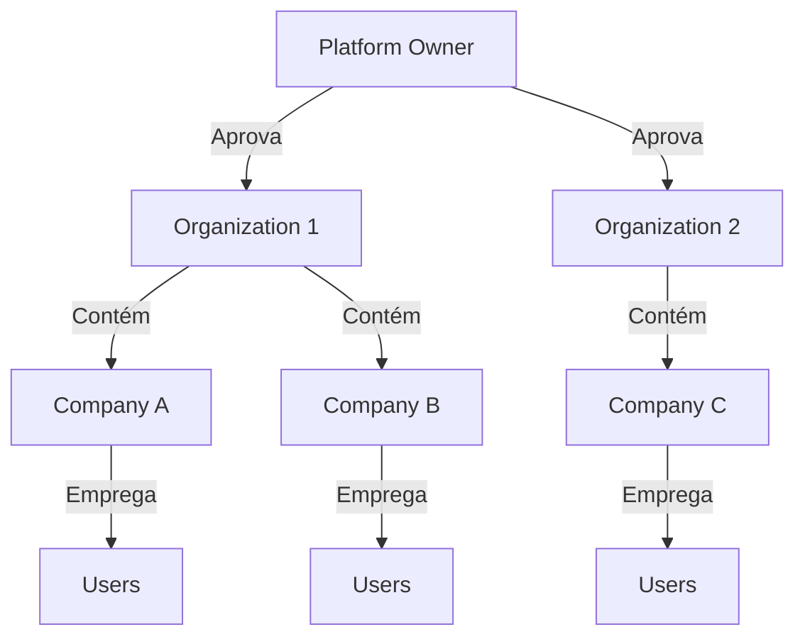
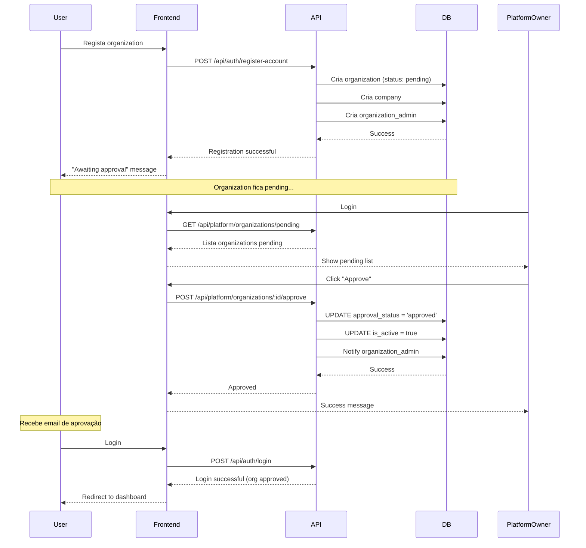
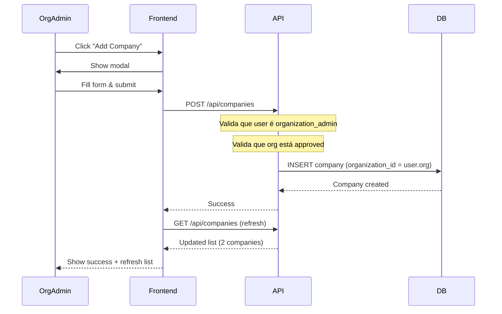

# Frontend Implementation Guide - Multi-Tenant Payroll System

**Versão:** 1.0  
**Data:** 18 de Dezembro de 2025  
**Status:** Production Ready  
**Branch:** test-results-queryallrows-migration

---

## 📋 Índice

1. [Visão Geral das Mudanças](#visão-geral-das-mudanças)
2. [Nova Hierarquia Multi-Tenant](#nova-hierarquia-multi-tenant)
3. [Roles e Permissões](#roles-e-permissões)
4. [Platform Owner - Nova Role](#platform-owner---nova-role)
5. [Organization Admin - Role Atualizada](#organization-admin---role-atualizada)
6. [Fluxos de Autenticação e Registo](#fluxos-de-autenticação-e-registo)
7. [Endpoints por Role](#endpoints-por-role)
8. [Requisitos de UI por View](#requisitos-de-ui-por-view)
9. [Workflows de Aprovação](#workflows-de-aprovação)
10. [Isolamento Multi-Tenant](#isolamento-multi-tenant)
11. [Sessões e Segurança](#sessões-e-segurança)

---

## 🎯 Visão Geral das Mudanças

### O Que Mudou?

O sistema evoluiu de uma arquitetura **single-organization** para um modelo **multi-tenant hierárquico** completo com os seguintes níveis:

```
Platform Owner (Super Admin)
    └── Organizations (pending → approved)
            └── Companies (múltiplas por organização)
                    └── Users (employees, managers, admins)
```

### Principais Melhorias Implementadas

✅ **Nova Role: Platform Owner**
- Super admin global da plataforma
- Gestão de todas as organizações
- Aprovação/rejeição de novos registos
- Vista global sem restrições de tenant

✅ **Multi-Company por Organization**
- Organizações podem ter **múltiplas companies**
- Organization Admin vê TODAS as companies da sua organização
- System Admin vê apenas a SUA company

✅ **Workflow de Aprovação**
- Novas organizações criadas com status `pending`
- Requerem aprovação do Platform Owner
- Utilizadores não conseguem fazer login até aprovação

✅ **Isolamento Total Multi-Tenant**
- Row-Level Security (RLS) no PostgreSQL
- Zero vazamento de dados entre organizações
- Validado com 62 testes end-to-end (95% pass rate)

---

## 🏢 Nova Hierarquia Multi-Tenant

### Níveis da Hierarquia



### Modelo de Dados

#### Organizations
- `id` (UUID)
- `name` (string)
- `is_active` (boolean) - `false` até aprovação
- `approval_status` (enum) - `pending` | `approved` | `rejected`
- `tier` (enum) - `standard` | `premium` | `enterprise`
- `approved_by` (UUID) - ID do Platform Owner
- `approved_at` (timestamp)
- `approval_notes` (text)

#### Companies
- `id` (UUID)
- `organization_id` (UUID) - **FK para Organizations**
- `name` (string)
- `country` (string)
- `business_email` (string)
- `is_active` (boolean)

#### Users
- `id` (UUID)
- `organization_id` (UUID) - **FK para Organizations**
- `company_id` (UUID) - **FK para Companies**
- `role` (enum) - ver seção [Roles](#roles-e-permissões)
- `is_active` (boolean)
- `can_login` (boolean) - **NOVO:** permite criar users sem acesso ao sistema

---

## 👥 Roles e Permissões

### Hierarquia de Roles

| Role | Nível | Scope | Organization ID | Company ID |
|------|-------|-------|-----------------|------------|
| **platform_owner** | Global | Todas as organizations | `NULL` | `NULL` |
| **organization_admin** | Organization | Todas as companies da org | ✅ | ❌ |
| **system_admin** | Company | Apenas a sua company | ✅ | ✅ |
| **hr_manager** | Company | Apenas a sua company | ✅ | ✅ |
| **payroll_manager** | Company | Apenas a sua company | ✅ | ✅ |
| **operational_manager** | Company | Apenas a sua company | ✅ | ✅ |
| **employee** | User | Apenas os seus dados | ✅ | ✅ |

### Permissões por Role

#### Platform Owner
- ✅ Ver TODAS as organizations
- ✅ Aprovar/rejeitar organizations pending
- ✅ Ver estatísticas globais
- ✅ Gerir platform settings
- ❌ Não tem organization_id nem company_id

#### Organization Admin
- ✅ Ver TODAS as companies da organização
- ✅ Criar novas companies
- ✅ Criar/editar users em qualquer company da org
- ✅ Ver relatórios consolidados da organização
- ❌ Não vê dados de outras organizações

#### System Admin (Company Admin)
- ✅ Ver apenas a SUA company
- ✅ Criar/editar users na sua company
- ✅ Gerir departamentos, leave policies, pay schedules
- ✅ Processar payroll
- ❌ Não vê outras companies (mesmo dentro da sua org)

#### Employee
- ✅ Ver apenas os SEUS dados
- ✅ Submeter timesheets, leave requests
- ✅ Ver os seus paystubs
- ❌ Sem acesso administrativo

---

## 🔑 Platform Owner - Nova Role

### Criação do Platform Owner

**Endpoint:** `POST /api/auth/bootstrap-platform-owner`

**Importante:** 
- ⚠️ Este endpoint **só funciona UMA VEZ**
- Após criar o primeiro Platform Owner, retorna `403 Forbidden`
- É o único endpoint público (não requer autenticação)

**Request:**
```json
{
  "full_name": "Platform Owner",
  "email": "owner@example.com",
  "password": "SecurePassword123!"
}
```

**Response:**
```json
{
  "success": true,
  "data": {
    "user": {
      "id": "3cd377b7-f32f-4b28-b2ae-5cbc0c7ba93b",
      "email": "owner@example.com",
      "role": "platform_owner",
      "full_name": "Platform Owner",
      "organization_id": null,
      "company_id": null,
      "is_active": true
    }
  }
}
```

### UI Requirements - Platform Owner Dashboard

#### 1. Vista Principal (Dashboard)

**Componentes necessários:**

- **KPIs Globais:**
  - Total de Organizations (pending, approved, rejected)
  - Total de Companies
  - Total de Users ativos
  - Growth charts (organizations/month)

- **Lista de Organizations Pending:**
  - Tabela com: Name, Created Date, Tier, Admin Email
  - Ações: `Approve` | `Reject`
  - Filtros: Status, Tier, Date Range

- **Lista de Todas as Organizations:**
  - Tabela com: Name, Status, Tier, Companies Count, Users Count
  - Search/Filter por nome, status, tier
  - Click para ver detalhes da organization

#### 2. Organization Detail View

**Informações a exibir:**

```typescript
interface OrganizationDetail {
  id: string;
  name: string;
  is_active: boolean;
  tier: 'standard' | 'premium' | 'enterprise';
  approval_status: 'pending' | 'approved' | 'rejected';
  approval_notes: string;
  approved_by: string; // Platform Owner name
  approved_at: Date;
  created_at: Date;
  
  // Agregações
  companies_count: number;
  users_count: number;
  active_users_count: number;
  
  // Companies da organization
  companies: Array<{
    id: string;
    name: string;
    country: string;
    users_count: number;
    is_active: boolean;
  }>;
}
```

**Actions:**
- Se status = `pending`: Botões `Approve` | `Reject`
- Se status = `approved`: Botão `Deactivate Organization`
- Ver auditoria de ações (approval history)

#### 3. Approve Organization Modal

**Campos:**
- ✅ Approval Notes (textarea, opcional)
- ✅ Tier Selection (dropdown): standard | premium | enterprise
- Botões: `Confirm Approval` | `Cancel`

**Endpoint:** `POST /api/platform/organizations/:id/approve`

**Request:**
```json
{
  "notes": "Approved for testing",
  "tier": "standard"
}
```

#### 4. Reject Organization Modal

**Campos:**
- ✅ Rejection Reason (textarea, obrigatório)
- Botões: `Confirm Rejection` | `Cancel`

**Endpoint:** `POST /api/platform/organizations/:id/reject`

**Request:**
```json
{
  "notes": "Invalid business information"
}
```

### Platform Owner Endpoints

| Endpoint | Method | Descrição |
|----------|--------|-----------|
| `/api/platform/organizations` | GET | Lista TODAS as organizations |
| `/api/platform/organizations/pending` | GET | Lista apenas organizations pending |
| `/api/platform/organizations/:id` | GET | Detalhes de uma organization |
| `/api/platform/organizations/:id/approve` | POST | Aprovar organization |
| `/api/platform/organizations/:id/reject` | POST | Rejeitar organization |
| `/api/platform/organizations/:id/stats` | GET | Estatísticas da organization |

---

## 🏗️ Organization Admin - Role Atualizada

### Mudanças Críticas

**ANTES (errado):**
```json
{
  "role": "system_admin",  // ❌ Criado no registo
  "scope": "Single company only"
}
```

**DEPOIS (correto):**
```json
{
  "role": "organization_admin",  // ✅ Criado no registo
  "scope": "All companies in organization"
}
```

### UI Requirements - Organization Admin Dashboard

#### 1. Vista Principal

**Header:**
- Organization Name
- Tier Badge (Standard/Premium/Enterprise)
- Status Indicator (Pending/Approved)

**Se Organization Status = Pending:**
```jsx
<Alert type="warning">
  Your organization is pending approval. 
  You can browse the system but cannot perform administrative actions 
  until a Platform Owner approves your organization.
</Alert>
```

**Componentes:**

- **Companies Overview:**
  - Grid/Cards das companies
  - Cada card: Name, Country, Users Count, Active Status
  - Botão: `+ Add New Company`
  - Click em card: navega para Company Detail

- **Organization-wide Stats:**
  - Total Employees (todas as companies)
  - Total Payroll Run this month (consolidado)
  - Active Leave Requests (consolidado)
  - Companies Count

#### 2. Companies Management

**Lista de Companies:**

```typescript
interface CompanyListItem {
  id: string;
  name: string;
  country: string;
  business_email: string;
  is_active: boolean;
  created_at: Date;
  
  // Agregações
  employees_count: number;
  active_employees: number;
  departments_count: number;
}
```

**Ações:**
- `Edit Company` - Editar informações básicas
- `View Details` - Ver dashboard da company
- `Manage Users` - Criar/editar users desta company
- `Deactivate` - Desativar company

**Endpoint:** `GET /api/companies`

**Response:**
```json
{
  "count": 2,
  "data": [
    {
      "id": "24c4e31d-f1a8-42a6-b452-06f47d0d2ff9",
      "organization_id": "2e168819-c47d-4c47-b314-f6f453d87684",
      "name": "Acme Corp",
      "country": "US",
      "is_active": true
    },
    {
      "id": "3db451e2-570c-4588-af6c-e1301a92d4be",
      "organization_id": "2e168819-c47d-4c47-b314-f6f453d87684",
      "name": "Acme Subsidiary",
      "country": "US",
      "is_active": true
    }
  ]
}
```

#### 3. Create New Company Modal

**Campos:**
- ✅ Company Name (required)
- ✅ Business Email (required, email format)
- ✅ Country (dropdown, required)
- Tax ID (optional)
- Address (optional)

**Endpoint:** `POST /api/companies`

**Request:**
```json
{
  "name": "Acme Subsidiary",
  "business_email": "subsidiary@acme.com",
  "country": "US",
  "tax_id": "12-3456789",
  "address": {
    "street": "123 Main St",
    "city": "New York",
    "state": "NY",
    "postal_code": "10001"
  }
}
```

#### 4. Multi-Company Switcher

**Importante:** Organization Admin vê dados de TODAS as companies.

**UI Patterns:**

**Opção A - Company Selector (recomendado):**
```jsx
<CompanySelector 
  companies={userCompanies}
  currentCompany={selectedCompany}
  onChange={handleCompanyChange}
  showAll={true} // Organization Admin pode ver "All Companies"
/>
```

**Opção B - Tab Navigation:**
```jsx
<Tabs>
  <Tab>All Companies Overview</Tab>
  <Tab>Acme Corp</Tab>
  <Tab>Acme Subsidiary</Tab>
</Tabs>
```

### Organization Admin Endpoints

| Endpoint | Method | Descrição | Scope |
|----------|--------|-----------|-------|
| `/api/companies` | GET | Lista companies da org | Organization |
| `/api/companies` | POST | Criar nova company | Organization |
| `/api/companies/:id` | GET | Detalhes de company | Organization |
| `/api/companies/:id` | PUT | Editar company | Organization |
| `/api/users` | GET | Lista users da org (todas companies) | Organization |
| `/api/users` | POST | Criar user em qualquer company | Organization |
| `/api/reports/organization` | GET | Relatórios consolidados | Organization |

---

## 🔐 Fluxos de Autenticação e Registo

### 1. Registo de Nova Organization

**Endpoint:** `POST /api/auth/register-account`

**Fluxo UI:**

```
1. User acessa página de registo
2. Preenche formulário:
   - Admin Info: Name, Email, Password
   - Company Info: Name, Business Email, Country
   - [Captcha Token]
3. Submit
4. Sistema cria:
   - Organization (status: pending, is_active: false)
   - Company (primeira da organização)
   - User (role: organization_admin)
5. Redirect para: "Registration Successful - Awaiting Approval"
```

**Request:**
```json
{
  "admin": {
    "full_name": "John Doe",
    "email": "john@acme.com",
    "password": "SecurePass123!"
  },
  "company": {
    "name": "Acme Corporation",
    "business_email": "info@acme.com",
    "country": "US"
  },
  "captcha_token": "..."
}
```

**Response:**
```json
{
  "success": true,
  "data": {
    "organization": {
      "id": "2e168819-c47d-4c47-b314-f6f453d87684",
      "name": "Acme Corporation",
      "is_active": false,
      "tier": "standard",
      "approval_status": "pending"
    },
    "company": {
      "id": "24c4e31d-f1a8-42a6-b452-06f47d0d2ff9",
      "name": "Acme Corporation"
    },
    "user": {
      "id": "4b31058c-db84-4c67-8156-d4117eb13a51",
      "email": "john@acme.com",
      "role": "organization_admin",
      "can_login": true
    }
  },
  "message": "Account registered successfully. Awaiting Platform Owner approval."
}
```

### 2. Login Flow

**Endpoint:** `POST /api/auth/login`

**Request:**
```json
{
  "email": "john@acme.com",
  "password": "SecurePass123!"
}
```

**Response (Success):**
```json
{
  "success": true,
  "data": {
    "user": {
      "id": "4b31058c-db84-4c67-8156-d4117eb13a51",
      "email": "john@acme.com",
      "role": "organization_admin",
      "full_name": "John Doe",
      "organization_id": "2e168819-c47d-4c47-b314-f6f453d87684",
      "company_id": "24c4e31d-f1a8-42a6-b452-06f47d0d2ff9",
      "is_active": true,
      "last_login": "2025-12-18T12:00:00Z"
    },
    "session_id": "...",
    "message": "Login successful"
  }
}
```

**Session Cookie:**
```
Set-Cookie: session_token=...;
  Path=/;
  Max-Age=1200;
  HttpOnly;
  SameSite=Lax
```

### 3. Role-Based Redirects

Após login bem-sucedido, redirecionar baseado na role:

```typescript
function getDefaultRoute(user: User): string {
  switch (user.role) {
    case 'platform_owner':
      return '/platform/dashboard';
    
    case 'organization_admin':
      return '/organization/dashboard';
    
    case 'system_admin':
      return '/admin/dashboard';
    
    case 'hr_manager':
      return '/hr/dashboard';
    
    case 'payroll_manager':
      return '/payroll/dashboard';
    
    case 'operational_manager':
      return '/manager/dashboard';
    
    case 'employee':
      return '/employee/dashboard';
    
    default:
      return '/unauthorized';
  }
}
```

### 4. Pending Organization Flow

**Quando organization_admin tenta login com organization pending:**

```json
{
  "success": true,
  "data": {
    "user": {...},
    "organization_status": "pending",
    "message": "Login successful. Organization pending approval."
  }
}
```

**UI deve mostrar:**
```jsx
<PendingApprovalBanner>
  Your organization is awaiting approval from a Platform Owner.
  You have read-only access until approval is granted.
</PendingApprovalBanner>
```

---

## 📡 Endpoints por Role

### Platform Owner Endpoints

```typescript
// Organizations Management
GET    /api/platform/organizations              // Lista todas
GET    /api/platform/organizations/pending      // Lista pending
GET    /api/platform/organizations/:id          // Detalhes
POST   /api/platform/organizations/:id/approve  // Aprovar
POST   /api/platform/organizations/:id/reject   // Rejeitar
GET    /api/platform/organizations/:id/stats    // Estatísticas

// Platform Stats
GET    /api/platform/stats                      // KPIs globais
GET    /api/platform/analytics                  // Analytics dashboard
```

### Organization Admin Endpoints

```typescript
// Companies (scope: organization)
GET    /api/companies                           // Lista todas da org
POST   /api/companies                           // Criar nova
GET    /api/companies/:id                       // Detalhes
PUT    /api/companies/:id                       // Editar
DELETE /api/companies/:id                       // Desativar

// Users (scope: organization - todas as companies)
GET    /api/users                               // Lista todos da org
POST   /api/users                               // Criar em qualquer company
GET    /api/users/:id                           // Detalhes
PUT    /api/users/:id                           // Editar
DELETE /api/users/:id                           // Desativar

// Organization Reports
GET    /api/reports/organization/payroll        // Consolidado de payroll
GET    /api/reports/organization/employees      // Consolidado de employees
GET    /api/reports/organization/leave          // Consolidado de leave
```

### System Admin Endpoints

```typescript
// Company Management (scope: own company only)
GET    /api/companies/:id                       // Apenas sua company
PUT    /api/companies/:id                       // Editar sua company

// Users (scope: own company only)
GET    /api/users                               // Apenas sua company
POST   /api/users                               // Criar na sua company
PUT    /api/users/:id                           // Editar na sua company

// Departments
GET    /api/departments                         // Lista
POST   /api/departments                         // Criar
PUT    /api/departments/:id                     // Editar

// Leave Policies
GET    /api/leave-policies                      // Lista
POST   /api/leave-policies                      // Criar
PUT    /api/leave-policies/:id                  // Editar

// Pay Schedules
GET    /api/pay-schedules                       // Lista
POST   /api/pay-schedules                       // Criar

// Payroll
POST   /api/payroll/calculate                   // Calcular
POST   /api/payroll/run/:id                     // Executar
GET    /api/payroll/history                     // Histórico
GET    /api/payroll/stats                       // Estatísticas
```

### Employee Endpoints

```typescript
// Self-Service
GET    /api/users/me                            // Dados próprios
PUT    /api/users/me                            // Editar perfil

// Timesheets
GET    /api/timesheets/my                       // Próprios timesheets
POST   /api/timesheets                          // Criar
PUT    /api/timesheets/:id                      // Editar (se DRAFT)
POST   /api/timesheets/:id/submit               // Submeter

// Leave Requests
GET    /api/leave-requests/my                   // Próprios pedidos
POST   /api/leave-requests                      // Criar
POST   /api/leave-requests/:id/submit           // Submeter
POST   /api/leave-requests/:id/cancel           // Cancelar
GET    /api/leave-balances/me                   // Saldos próprios

// Paystubs
GET    /api/paystubs/my                         // Próprios paystubs
GET    /api/paystubs/:id/download               // Download PDF

// Notifications
GET    /api/notifications                       // Próprias notificações
PUT    /api/notifications/:id/read              // Marcar como lida
```

---

## 🎨 Requisitos de UI por View

### 1. Platform Owner Dashboard

**Layout sugerido:**

```
┌─────────────────────────────────────────────────┐
│ Platform Owner Dashboard                        │
├─────────────────────────────────────────────────┤
│                                                 │
│  📊 KPIs:                                       │
│  [Total Orgs] [Pending] [Companies] [Users]    │
│                                                 │
├─────────────────────────────────────────────────┤
│                                                 │
│  🔔 Pending Approvals (3)                       │
│  ┌──────────────────────────────────────────┐  │
│  │ Acme Corp    | Standard | john@acme.com  │  │
│  │ Created: 2 days ago                       │  │
│  │ [Approve] [Reject] [View Details]         │  │
│  ├──────────────────────────────────────────┤  │
│  │ Beta Inc     | Premium  | admin@beta.com │  │
│  │ Created: 5 hours ago                      │  │
│  │ [Approve] [Reject] [View Details]         │  │
│  └──────────────────────────────────────────┘  │
│                                                 │
├─────────────────────────────────────────────────┤
│                                                 │
│  🏢 All Organizations                           │
│  [Search] [Filter: All|Pending|Approved]       │
│  ┌──────────────────────────────────────────┐  │
│  │ Name         | Status   | Companies | ... │  │
│  ├──────────────────────────────────────────┤  │
│  │ Acme Corp    | Approved | 2        | ... │  │
│  │ Beta Inc     | Pending  | 1        | ... │  │
│  └──────────────────────────────────────────┘  │
│                                                 │
└─────────────────────────────────────────────────┘
```

**Componentes React (exemplo):**

```tsx
interface PlatformDashboardProps {}

const PlatformDashboard: React.FC = () => {
  const { data: stats } = useQuery('/api/platform/stats');
  const { data: pending } = useQuery('/api/platform/organizations/pending');
  const { data: allOrgs } = useQuery('/api/platform/organizations');

  return (
    <div className="platform-dashboard">
      <KPICards stats={stats} />
      <PendingApprovalsSection organizations={pending} />
      <AllOrganizationsTable organizations={allOrgs} />
    </div>
  );
};

const PendingApprovalsSection: React.FC<{ organizations }> = ({ organizations }) => {
  const [approving, setApproving] = useState<string | null>(null);

  const handleApprove = async (orgId: string) => {
    const notes = await showApprovalModal();
    await api.post(`/api/platform/organizations/${orgId}/approve`, { notes });
    // Refresh list
  };

  return (
    <section>
      <h2>Pending Approvals ({organizations.count})</h2>
      {organizations.data.map(org => (
        <PendingOrgCard 
          key={org.id}
          organization={org}
          onApprove={() => handleApprove(org.id)}
          onReject={() => handleReject(org.id)}
        />
      ))}
    </section>
  );
};
```

### 2. Organization Admin Dashboard

**Layout sugerido:**

```
┌─────────────────────────────────────────────────┐
│ Acme Corporation (Standard Tier)                │
│ Status: ✅ Approved                             │
├─────────────────────────────────────────────────┤
│                                                 │
│  📊 Organization Overview:                      │
│  [Companies: 2] [Total Employees: 45]           │
│  [This Month Payroll: $125,000]                 │
│                                                 │
├─────────────────────────────────────────────────┤
│                                                 │
│  🏢 Companies                  [+ Add Company]  │
│  ┌──────────────────────────────────────────┐  │
│  │ 📍 Acme Corp (US)                         │  │
│  │ 25 employees | 3 departments              │  │
│  │ [View] [Manage Users]                     │  │
│  ├──────────────────────────────────────────┤  │
│  │ 📍 Acme Subsidiary (US)                   │  │
│  │ 20 employees | 2 departments              │  │
│  │ [View] [Manage Users]                     │  │
│  └──────────────────────────────────────────┘  │
│                                                 │
├─────────────────────────────────────────────────┤
│                                                 │
│  📈 Quick Stats:                                │
│  • Active Leave Requests: 12                    │
│  • Pending Timesheets: 8                        │
│  • Upcoming Payroll: Jan 5, 2026                │
│                                                 │
└─────────────────────────────────────────────────┘
```

**Componentes React (exemplo):**

```tsx
interface OrganizationDashboardProps {
  user: User; // organization_admin
}

const OrganizationDashboard: React.FC<{ user }> = ({ user }) => {
  const { data: companies } = useQuery('/api/companies');
  const { data: stats } = useQuery('/api/reports/organization/stats');
  const [selectedCompany, setSelectedCompany] = useState<string | 'all'>('all');

  // Check if organization is pending
  if (user.organization.approval_status === 'pending') {
    return <PendingApprovalView />;
  }

  return (
    <div className="org-dashboard">
      <OrganizationHeader 
        name={user.organization.name}
        tier={user.organization.tier}
        status={user.organization.approval_status}
      />
      
      <OrganizationKPIs stats={stats} />
      
      <CompaniesSection 
        companies={companies}
        onAddCompany={() => showAddCompanyModal()}
        onSelectCompany={setSelectedCompany}
      />
      
      {selectedCompany === 'all' ? (
        <ConsolidatedReports />
      ) : (
        <CompanyDetailView companyId={selectedCompany} />
      )}
    </div>
  );
};

const CompaniesSection: React.FC<{ companies }> = ({ companies }) => {
  return (
    <section>
      <div className="section-header">
        <h2>Companies ({companies.count})</h2>
        <Button onClick={onAddCompany}>+ Add Company</Button>
      </div>
      
      <div className="companies-grid">
        {companies.data.map(company => (
          <CompanyCard 
            key={company.id}
            company={company}
            onView={() => navigate(`/companies/${company.id}`)}
            onManageUsers={() => navigate(`/companies/${company.id}/users`)}
          />
        ))}
      </div>
    </section>
  );
};
```

### 3. System Admin Dashboard

**Nota:** System Admin vê apenas a SUA company (não outras da organização)

```
┌─────────────────────────────────────────────────┐
│ Acme Corp - Admin Dashboard                    │
├─────────────────────────────────────────────────┤
│                                                 │
│  📊 Company Stats:                              │
│  [Employees: 25] [Departments: 3]               │
│  [Active Leave: 5] [Pending Timesheets: 8]     │
│                                                 │
├─────────────────────────────────────────────────┤
│  Navigation:                                    │
│  • 👥 Employees & Users                         │
│  • 🏢 Departments                               │
│  • 📅 Leave Policies                            │
│  • 💰 Payroll Management                        │
│  • ⏰ Pay Schedules                             │
│  • 📄 Documents                                 │
└─────────────────────────────────────────────────┘
```

### 4. Pending Approval View

**Quando organization_admin faz login com org pending:**

```tsx
const PendingApprovalView: React.FC = () => {
  return (
    <div className="pending-approval-container">
      <Alert variant="warning" icon={<ClockIcon />}>
        <h3>Organization Pending Approval</h3>
        <p>
          Your organization registration has been submitted and is awaiting 
          approval from a Platform Owner. You will receive an email notification 
          once your organization is approved.
        </p>
        <p className="text-muted">
          Registered: {formatDate(user.organization.created_at)}
        </p>
      </Alert>

      <div className="limited-access-info">
        <h4>What you can do while waiting:</h4>
        <ul>
          <li>✅ View your organization details</li>
          <li>✅ Edit your profile</li>
          <li>✅ Browse documentation</li>
          <li>❌ Create companies (requires approval)</li>
          <li>❌ Add users (requires approval)</li>
          <li>❌ Process payroll (requires approval)</li>
        </ul>
      </div>

      <Button onClick={logout}>Logout</Button>
    </div>
  );
};
```

---

## 🔄 Workflows de Aprovação

### Workflow 1: Nova Organization



### Workflow 2: Organization Admin Cria Company



---

## 🔒 Isolamento Multi-Tenant

### Como Funciona

O sistema usa **Row-Level Security (RLS)** no PostgreSQL para garantir isolamento total:

1. **Session Variables:** Cada request define:
   - `app.current_organization_id`
   - `app.current_company_id`
   - `app.bypass_rls` (apenas para platform_owner)

2. **RLS Policies:** Cada tabela tem policies que filtram:
```sql
-- Exemplo: companies table
CREATE POLICY companies_tenant_isolation ON companies
  USING (
    bypass_rls = true  -- Platform Owner vê tudo
    OR organization_id = current_setting('app.current_organization_id')::uuid
  );
```

3. **Frontend não precisa filtrar:** O backend garante que queries NUNCA retornam dados de outros tenants

### Validação de Isolamento

✅ **Testado com 62 testes end-to-end:**
- Admin Acme **NÃO VÊ** dados da Beta
- Admin Beta **NÃO VÊ** dados da Acme
- Organization Admin **VÊ TODAS** as companies da sua org
- System Admin **VÊ APENAS** a sua company
- Employee **VÊ APENAS** os seus dados

### Implicações para Frontend

**✅ O que fazer:**
- Sempre enviar cookies de sessão
- Confiar nos dados retornados pela API
- Não fazer filtragem adicional por organization/company

**❌ O que NÃO fazer:**
- Tentar "adivinhar" quais dados o user pode ver
- Fazer filtragem client-side por organization_id
- Cachear dados entre diferentes users/sessions

---

## 🔐 Sessões e Segurança

### Session Management

**Tipo:** Session-based com cookies HTTP-only

**Cookie:**
```
session_token=<hash>;
Path=/;
Max-Age=1200;  // 20 minutos
HttpOnly;       // Não acessível via JavaScript
Secure;         // Apenas via HTTPS (obrigatório em produção)
SameSite=Lax;   // CSRF protection
```

### Headers Requeridos

**Todos os requests autenticados:**
```
Cookie: session_token=...
```

**Não é necessário:**
- ❌ Authorization header
- ❌ Bearer tokens
- ❌ JWT tokens

### Logout

**Endpoint:** `POST /api/auth/logout`

```typescript
const logout = async () => {
  await api.post('/api/auth/logout');
  // Cookie é automaticamente removido
  window.location.href = '/login';
};
```

### Session Expiry

- **Timeout:** 20 minutos de inatividade
- **Renovação:** Automática a cada request
- **Expiração:** Frontend deve tratar `401 Unauthorized` e redirecionar para login

```typescript
api.interceptors.response.use(
  response => response,
  error => {
    if (error.response?.status === 401) {
      // Session expirada
      window.location.href = '/login';
    }
    return Promise.reject(error);
  }
);
```

---

## 📝 User Management - Campo `can_login`

### Nova Feature: Users sem Login

**Use cases:**
- Contractors temporários
- Registos históricos de ex-funcionários
- Employees que apenas precisam existir no sistema (sem self-service)

**Campo:** `can_login` (boolean)

**Comportamento:**
- `can_login: true` → User pode fazer login (requer password)
- `can_login: false` → User existe mas NÃO pode autenticar (password opcional)

### UI - Create User Form

```tsx
interface CreateUserFormData {
  full_name: string;
  email: string;
  role: UserRole;
  company_id: string;
  department_id?: string;
  can_login: boolean;
  password?: string;  // Apenas se can_login = true
  is_employee: boolean;
}

const CreateUserForm: React.FC = () => {
  const [canLogin, setCanLogin] = useState(true);

  return (
    <form>
      <Input name="full_name" label="Full Name" required />
      <Input name="email" label="Email" type="email" required />
      <Select name="role" label="Role" options={roleOptions} required />
      
      <Checkbox 
        name="can_login" 
        label="Allow system login"
        checked={canLogin}
        onChange={setCanLogin}
      />
      
      {canLogin && (
        <>
          <Input 
            name="password" 
            label="Password" 
            type="password" 
            required 
          />
          <PasswordStrengthIndicator />
        </>
      )}
      
      <Checkbox name="is_employee" label="Is Employee" />
      <Select name="department_id" label="Department" />
      
      <Button type="submit">Create User</Button>
    </form>
  );
};
```

**Validação:**
- Se `can_login: true` → password é obrigatório
- Se `can_login: false` → password pode ser null/omitido

---

## 🎨 Component Library Recommendations

### Componentes Necessários

```typescript
// Organization/Company Management
<OrganizationSelector />
<CompanySelector showAll={isOrgAdmin} />
<PendingApprovalBanner />
<ApprovalModal type="approve|reject" />

// Platform Owner
<PlatformDashboard />
<OrganizationCard status="pending|approved|rejected" />
<ApprovalButton />
<RejectButton />

// Multi-Company Views
<CompanyGrid companies={[]} />
<CompanyCard />
<ConsolidatedStats />

// User Management
<UserForm allowCanLogin />
<RoleSelector />
<CanLoginToggle />

// Common
<StatusBadge status="pending|approved|rejected" />
<TierBadge tier="standard|premium|enterprise" />
<RoleBadge role={userRole} />
```

### Design System Tokens

```typescript
// Status Colors
const statusColors = {
  pending: '#FFA500',    // Orange
  approved: '#28A745',   // Green
  rejected: '#DC3545',   // Red
};

// Tier Colors
const tierColors = {
  standard: '#6C757D',   // Gray
  premium: '#007BFF',    // Blue
  enterprise: '#6F42C1', // Purple
};

// Role Colors
const roleColors = {
  platform_owner: '#DC3545',      // Red
  organization_admin: '#6F42C1',  // Purple
  system_admin: '#007BFF',        // Blue
  hr_manager: '#28A745',          // Green
  payroll_manager: '#FFC107',     // Yellow
  operational_manager: '#17A2B8', // Cyan
  employee: '#6C757D',            // Gray
};
```

---

## 🧪 Testing Frontend

### Test Scenarios

#### 1. Platform Owner Flow
```typescript
describe('Platform Owner Dashboard', () => {
  it('should show pending organizations', async () => {
    // Login as platform owner
    await login('owner@example.com', 'password');
    
    // Should see pending list
    expect(screen.getByText('Pending Approvals')).toBeInTheDocument();
    expect(screen.getByText('Acme Corp')).toBeInTheDocument();
  });

  it('should approve organization', async () => {
    await login('owner@example.com', 'password');
    
    // Click approve
    await userEvent.click(screen.getByText('Approve'));
    
    // Fill modal
    await userEvent.type(screen.getByLabelText('Notes'), 'Approved');
    await userEvent.click(screen.getByText('Confirm Approval'));
    
    // Should show success
    expect(screen.getByText('Organization approved')).toBeInTheDocument();
  });
});
```

#### 2. Organization Admin Multi-Company
```typescript
describe('Organization Admin Dashboard', () => {
  it('should show all companies in organization', async () => {
    await login('admin@acme.com', 'password');
    
    // Should see both companies
    expect(screen.getByText('Acme Corp')).toBeInTheDocument();
    expect(screen.getByText('Acme Subsidiary')).toBeInTheDocument();
  });

  it('should create new company', async () => {
    await login('admin@acme.com', 'password');
    
    await userEvent.click(screen.getByText('+ Add Company'));
    await userEvent.type(screen.getByLabelText('Company Name'), 'New Company');
    await userEvent.type(screen.getByLabelText('Business Email'), 'new@acme.com');
    await userEvent.selectOptions(screen.getByLabelText('Country'), 'US');
    await userEvent.click(screen.getByText('Create'));
    
    // Should refresh and show new company
    await waitFor(() => {
      expect(screen.getByText('New Company')).toBeInTheDocument();
    });
  });
});
```

#### 3. Tenant Isolation
```typescript
describe('Multi-Tenant Isolation', () => {
  it('should not show other organization data', async () => {
    // Login as Acme admin
    await login('admin@acme.com', 'password');
    
    // Should NOT see Beta companies
    expect(screen.queryByText('Beta Inc')).not.toBeInTheDocument();
    
    // Logout and login as Beta admin
    await logout();
    await login('admin@beta.com', 'password');
    
    // Should NOT see Acme companies
    expect(screen.queryByText('Acme Corp')).not.toBeInTheDocument();
  });
});
```

---

## 📚 API Response Examples

### GET /api/platform/organizations (Platform Owner)

```json
{
  "count": 2,
  "data": [
    {
      "id": "2e168819-c47d-4c47-b314-f6f453d87684",
      "name": "Acme Corp",
      "is_active": true,
      "tier": "standard",
      "approval_status": "approved",
      "approval_notes": "Approved for testing",
      "approved_by": "3cd377b7-f32f-4b28-b2ae-5cbc0c7ba93b",
      "approved_at": "2025-12-17T12:50:37.691736Z",
      "created_at": "2025-12-17T12:49:36.843336Z",
      "updated_at": "2025-12-17T12:50:39.012111Z",
      
      "companies_count": 2,
      "users_count": 45,
      "active_users_count": 42
    },
    {
      "id": "957aa0f3-ae53-44c8-9897-e359d812c847",
      "name": "Beta Industries",
      "is_active": true,
      "tier": "premium",
      "approval_status": "approved",
      "created_at": "2025-12-17T12:53:52.415234Z",
      
      "companies_count": 1,
      "users_count": 12,
      "active_users_count": 10
    }
  ],
  "success": true
}
```

### GET /api/companies (Organization Admin)

```json
{
  "count": 2,
  "data": [
    {
      "id": "24c4e31d-f1a8-42a6-b452-06f47d0d2ff9",
      "organization_id": "2e168819-c47d-4c47-b314-f6f453d87684",
      "name": "Acme Corp",
      "country": "US",
      "business_email": "info@acme.com",
      "is_active": true,
      "created_at": "2025-12-17T12:49:38.590677Z",
      "updated_at": "2025-12-17T12:49:42.805298Z",
      
      "employees_count": 25,
      "active_employees": 23,
      "departments_count": 3
    },
    {
      "id": "3db451e2-570c-4588-af6c-e1301a92d4be",
      "organization_id": "2e168819-c47d-4c47-b314-f6f453d87684",
      "name": "Acme Subsidiary",
      "country": "US",
      "business_email": "subsidiary@acme.com",
      "is_active": true,
      "created_at": "2025-12-17T12:51:16.981539965Z",
      
      "employees_count": 20,
      "active_employees": 19,
      "departments_count": 2
    }
  ],
  "success": true
}
```

---

## 🚀 Implementation Roadmap

### Phase 1: Platform Owner (Priority: P0)

- [ ] Bootstrap Platform Owner endpoint
- [ ] Platform Owner login flow
- [ ] Platform Dashboard (KPIs)
- [ ] Pending Organizations list
- [ ] Approve/Reject modals
- [ ] All Organizations table
- [ ] Organization detail view

**Estimativa:** 2-3 semanas

### Phase 2: Organization Admin (Priority: P0)

- [ ] Organization registration flow
- [ ] Pending approval view
- [ ] Organization Dashboard
- [ ] Companies grid/list
- [ ] Create Company modal
- [ ] Company detail view
- [ ] Multi-company selector
- [ ] Consolidated reports

**Estimativa:** 3-4 semanas

### Phase 3: User Management (Priority: P1)

- [ ] User list (filtered by company/org)
- [ ] Create User form (with can_login toggle)
- [ ] Edit User
- [ ] Role assignment
- [ ] Department assignment
- [ ] User deactivation

**Estimativa:** 2 semanas

### Phase 4: Testing & Refinement (Priority: P0)

- [ ] Unit tests
- [ ] Integration tests
- [ ] E2E tests (Playwright/Cypress)
- [ ] Multi-tenant isolation tests
- [ ] Performance tests
- [ ] Security audit

**Estimativa:** 2-3 semanas

---

## 📞 Support & Questions

### Backend Endpoints Tested

✅ **62 endpoints testados**  
✅ **59 passed (95%)**  
✅ **Todos os issues críticos resolvidos**

### Known Issues

1. ⚠️ **Export endpoints** retornam 404 quando não há dados
   - Recomendação: Retornar 200 com Excel vazio ou mensagem apropriada

2. ⚠️ **RBAC error messages** - Employee blocked retorna 500 em vez de 403
   - Recomendação: Padronizar para 403 Forbidden

### Contact

Para questões sobre implementação frontend ou clarificações sobre endpoints:
- **Backend Lead:** [email]
- **API Documentation:** [Swagger/OpenAPI URL]
- **QA Report:** `QA_MULTI_TENANT_TEST_REPORT.md`

---

## 🎯 Quick Start Checklist

### Para começar a desenvolver:

- [ ] Ler este documento completo
- [ ] Configurar ambiente de desenvolvimento
- [ ] Testar endpoints no Postman/Insomnia
- [ ] Criar Platform Owner (bootstrap endpoint)
- [ ] Registar organization de teste
- [ ] Aprovar organization como Platform Owner
- [ ] Fazer login como Organization Admin
- [ ] Criar segunda company
- [ ] Validar multi-tenant isolation

### Ferramentas Recomendadas

- **API Testing:** Postman Collection disponível
- **State Management:** React Query / TanStack Query (recomendado para cache)
- **Forms:** React Hook Form + Zod validation
- **UI Components:** shadcn/ui, MUI, ou Ant Design
- **Routing:** React Router v6
- **Auth:** Context API + React Query para session management

---

**Documento gerado em:** 18 de Dezembro de 2025  
**Versão:** 1.0  
**Status:** Production Ready ✅  
**Branch:** test-results-queryallrows-migration
